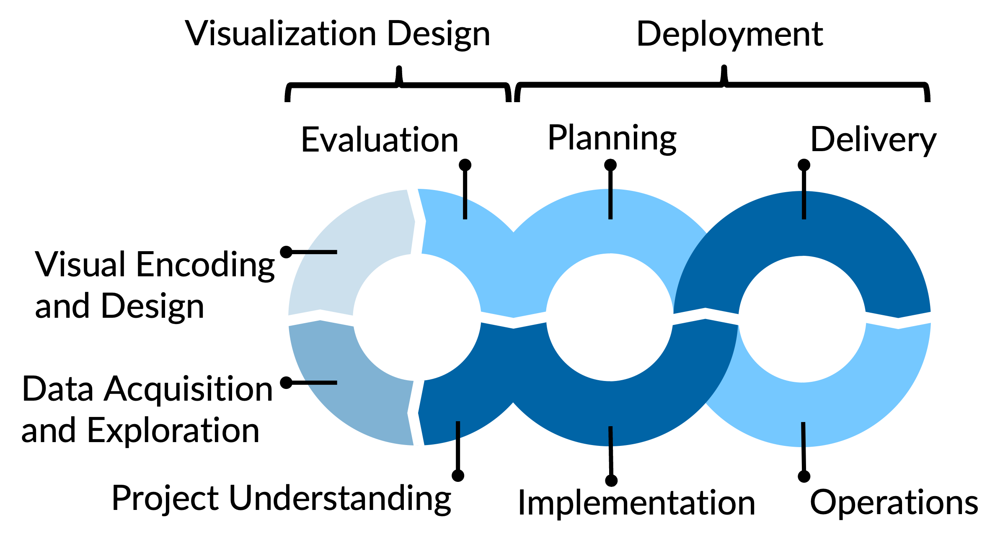

# Stromverbrauch Schweiz 1990–2025

Visualisierungsprojekt VDSS (FS26 — Gruppe 4)

Dieses Projekt untersucht die Entwicklung des Schweizer Stromverbrauchs zwischen
1990 und 2025 und macht saisonale Muster und langfristige Trends sichtbar. Im
Mittelpunkt steht die Frage, ob die Schweiz trotz Bevölkerungswachstum und
wärmerer Winter wirklich effizienter geworden ist — beantwortet anhand
öffentlich verfügbarer Daten von BFE, BFS und MeteoSchweiz.

**Team:** Silvan, Salomon, Fabian

## Projektorganisation

Die Entwicklung folgt dem Prozessmodell für Visualisierungsprodukte aus dem
Modul. Code und Konfigurationen liegen in den Phasenordnern, die Dokumentation
als Quarto-Projekt in `docs/`.



| Phase                            | Code-Ordner            | Dokumentation                |
|----------------------------------|------------------------|------------------------------|
| Projektverständnis               | —                      | `docs/project_charta.qmd`    |
| Datenakquise & Aufbereitung      | `data_acquisition/`    | `docs/data_report.qmd`       |
| Explorative Datenanalyse         | `eda/`                 | `docs/data_report.qmd`       |
| Visual Design                    | `viz_design/`          | `docs/viz_design_report.qmd` |
| Implementierung (Dashboard)      | `Dashboard/`           | `docs/viz_design_report.qmd` |
| Evaluation                       | `evaluation/`          | `docs/viz_design_report.qmd` |
| Deployment                       | `deployment/` + `.github/workflows/` | `docs/deployment.qmd` |

Die Heizbedarf-Werte für die Jahre 1990–1993 stammen aus einer eigenen
Regression (`data_acquisition/regression_heizbedarf.py`), da MeteoSchweiz für
diesen Zeitraum keine direkten Werte publiziert.

📖 **Live-Dokumentation:** <https://vdss-fs26-ds25a.github.io/Visualisation-Projekt-Gruppe-4/>
*(automatisch deployed via GitHub Actions bei jedem Push auf `main`)*

## Dashboard ausführen

Das interaktive Dashboard liegt in `Dashboard/` und ist mit
[Streamlit](https://streamlit.io/) gebaut.

### Schnellstart (Windows)

Doppelklick auf `Dashboard/start_Dashboard_Industrie_Reaktor.bat`.

Das Skript erstellt beim ersten Start ein virtuelles Environment (`venv/`),
installiert die Requirements und startet Streamlit. Beim nächsten Mal überspringt
es Setup und Installation und öffnet das Dashboard direkt im Browser unter
<http://localhost:8501>.

### Manuell

```bash
cd Dashboard
python -m venv venv
venv\Scripts\activate           # Windows
# source venv/bin/activate      # macOS / Linux
pip install -r requirements.txt
streamlit run Dashboard_Industrie_Reaktor.py
```

### Module im Dashboard

| Modul                    | Inhalt                                                                        |
|--------------------------|-------------------------------------------------------------------------------|
| Übersicht                | Stromverbrauch im Zeitverlauf mit 3/6/9/12-Monats-Trend und Bevölkerung       |
| Verbrauch × Temperatur   | Doppelachsen-Vergleich Jahresmittel-Verbrauch und -Temperatur                 |
| Korrelation              | Streudiagramm Temperatur vs. Verbrauch pro Kopf, Vergleich Wachstum/Sättigung |
| Effizienz / Heizen       | Witterungsbereinigte Effizienz (Verbrauch ÷ Heizbedarf) über die Zeit         |

Filterbar nach Zeitbereich und Jahreszeiten; oben rechts die Kernkraft-Kennzahl
und in der Sidebar der Reaktor-Auslastungs-Indikator je nach selektierten Saisons.

## Python Environment Setup and Management with uv
Make sure to have uv installed: https://docs.astral.sh/uv/getting-started/installation/

After cloning the repository,  create the python environment with all dependencies based on the `.python-version`, `pyproject.toml` and `uv.lock` files by running
```bash
uv sync
```

To add new dependencies, use
```bash
uv add <package>
```
which will add the package to `pyproject.toml` and update the `uv.lock` file. You can also specify a version, e.g. `uv add pandas==2.0.3`.

Remove packages with
```bash
uv remove <package>
```

Commit changes to `pyproject.toml` and `uv.lock` files into version control.

Run `uv sync` after pulling changes to update the local environment.

Whenever the python environment is used, make sure to prefix every command that uses python with `uv run`, e.g.
```bash
uv run python script.py
```

You can also run
```bash 
source .venv/bin/activate
```
to activate the project Python environment in a terminal session in order to avoid having to prefix every command.

## Runtime Configuration with Environment Variables
The environment variables are specified in a .env-File, which is never commited into version control, as it may contain secrets. The repo just contains the file `.env.template` to demonstrate how environment variables are specified.

You have to create a local copy of `.env.template` in the project root folder and the easiest is to just rename it to `.env`.

The content of the .env-file is then read by the pypi-dependency: `python-dotenv`. Usage:
```python
import os
from dotenv import load_dotenv
```

`load_dotenv` reads the .env-file and sets the environment variables:

```python
load_dotenv()
```

which can then be accessed (assuming the file contains a line `SAMPLE_VAR=<some value>`):

```python
os.environ['SAMPLE_VAR']
```

## Quarto Setup and Usage

### Setup Quarto

1. [Install Quarto](https://quarto.org/docs/get-started/)
2. Optional: [quarto-extension for VS Code](https://marketplace.visualstudio.com/items?itemName=quarto.quarto)
3. If working with svg files and pdf output you will need to install rsvg-convert:
    * On macOS: `brew install librsvg`
    * On Windows using chocolatey:
      * [Install chocolatey](https://chocolatey.org/install#individual)
      * [Install rsvg-convert](https://community.chocolatey.org/packages/rsvg-convert): `choco install rsvg-convert`

Source `*.qmd` and configuration files are in the `docs` folder. The Quarto project configuration is in `docs/_quarto.yml`.

With embedded python code chunks that perform computations, you need to make sure that the python environment is activated when rendering. This can be done by prefixing the render command with `uv run`, e.g.:
```bash
uv run quarto render
```

### Working on the Documentation

1. Make changes to the `.qmd` source files in the `docs` folder
2. Make sure the project Python environment is activated (see Python environment setup and management)
3. Preview locally: `quarto preview` from the `docs` folder
4. Build the documentation website: `uv run quarto render` from the `docs` folder. This renders to `docs/build`
5. Check the website locally by opening `docs/build/index.html` in a browser

### Deployment of the Documentation to GitHub Pages

The documentation website is deployed to GitHub Pages via a GitHub Actions workflow (`.github/workflows/publish.yml`). Every push to `main` triggers the workflow, which renders the Quarto project and deploys the result.

The setting `execute: freeze: auto` in `_quarto.yml` ensures that Python computations are only executed locally. Results are cached in `docs/_freeze` and checked into the repository, so the GitHub Actions runner does not need Python — it uses the pre-computed results.

#### Initial Setup (once)

1. In the GitHub repository settings, go to **Settings > Pages** and set the source to **GitHub Actions**
2. Render locally so that `_freeze` contains cached computation results:
   ```bash
   cd docs && uv run quarto render
   ```
3. Push the changes to `main`

The `_freeze` directory and the workflow file `.github/workflows/publish.yml` should already be tracked in the repository.

#### Publishing Updates

1. Build the website locally: `uv run quarto render` from the `docs` folder. This updates `docs/build` (gitignored) and `docs/_freeze` (checked in)
2. Check the website locally by opening `docs/build/index.html`
3. Commit and push all updated files (including `docs/_freeze`) to `main`. The GitHub Actions workflow will render and deploy the site automatically
